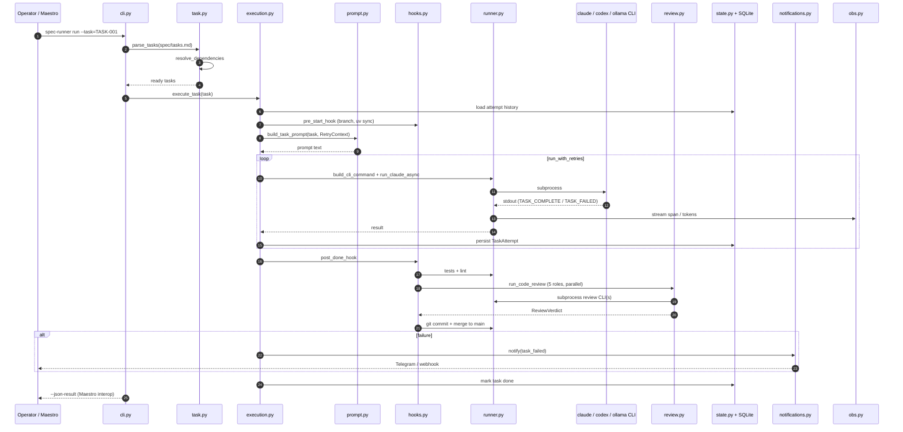
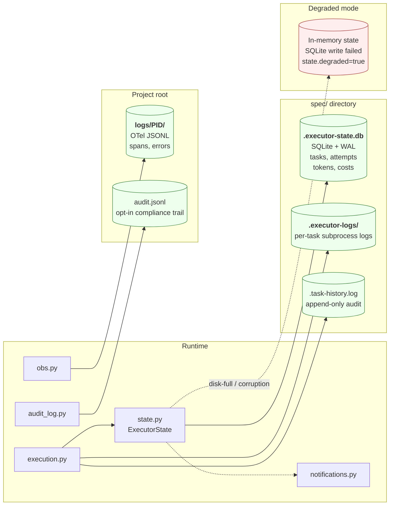

# spec-runner — architecture

Layered view of `spec-runner` v2.7.0. Generated 2026-05-25, module map refreshed 2026-07-01 (added `preset_cmd.py`, `doctor.py`, `spec.py`, `spec_commands.py`).

## System context

External actors, integrations, and where they touch spec-runner.

```mermaid
flowchart LR
    operator([Operator / CI])
    maestro[Maestro<br/>orchestrator]
    mcp_client[MCP client<br/>e.g. Claude Desktop]
    gh_api[GitHub<br/>Issues API]
    telegram[Telegram<br/>bot]
    webhook_rx[Webhook<br/>receiver]
    claude_cli[claude CLI]
    codex_cli[codex CLI]
    other_cli[ollama / llama-cli<br/>llama-server / custom]
    gh_cli[gh CLI]
    git_bin[git]

    subgraph sr["spec-runner"]
        direction TB
        sr_cli[CLI<br/>spec-runner ...]
        sr_mcp[MCP server<br/>stdio]
        sr_tui[TUI dashboard]
        sr_state[(.executor-state.db<br/>SQLite + WAL)]
        sr_obs[(logs/PID.jsonl<br/>OTel)]
        sr_audit[(audit.jsonl)]
    end

    operator --> sr_cli
    operator --> sr_tui
    maestro -- --json-result<br/>+ reads --> sr_cli
    maestro -. SQLite read .-> sr_state
    mcp_client -- stdio --> sr_mcp

    sr_cli --> claude_cli & codex_cli & other_cli
    sr_cli --> git_bin
    sr_cli --> gh_cli --> gh_api
    sr_cli -. task_failed<br/>run_complete<br/>state_degraded .-> telegram & webhook_rx
    sr_cli --> sr_state & sr_obs & sr_audit
    sr_tui --> sr_state

    classDef ext fill:#eef,stroke:#446
    classDef cli fill:#ffe,stroke:#a82
    classDef store fill:#efe,stroke:#484
    class operator,maestro,mcp_client,gh_api,telegram,webhook_rx ext
    class claude_cli,codex_cli,other_cli,gh_cli,git_bin cli
    class sr_state,sr_obs,sr_audit store
```

## Module map

Layered view of the modules in `src/spec_runner/`.

```mermaid
flowchart TB
    subgraph entry["Entry points"]
        direction LR
        cli["cli.py<br/>argparse dispatcher<br/>cmd_run / cmd_watch<br/>build_task_json_result"]
        mcp_server["mcp_server.py<br/>FastMCP, stdio"]
        tui["tui.py<br/>Textual dashboard"]
        executor_mod["executor.py<br/>signal handlers<br/>re-exports"]
    end

    subgraph commands["Command modules"]
        direction LR
        cli_info["cli_info.py<br/>status / verify<br/>report / costs / logs"]
        cli_plan["cli_plan.py<br/>plan (interactive + --full + --gated)"]
        spec_cmds["spec_commands.py<br/>spec status/approve<br/>reject/adopt/check"]
        preset_cmd["preset_cmd.py<br/>config (CLI presets)"]
        doctor_cmd["doctor.py<br/>CLI/model probe"]
        task_cmds["task_commands.py<br/>list / show / next<br/>graph / stats"]
        github_sync["github_sync.py<br/>sync-to-gh<br/>sync-from-gh"]
        init_cmd["init_cmd.py<br/>install skills"]
    end

    subgraph core["Orchestration core"]
        direction LR
        execution["execution.py<br/>execute_task<br/>retry strategy<br/>RetryContext"]
        errors_m["errors.py<br/>classify stderr<br/>→ error_kind"]
        stages_m["stages.py<br/>StageReporter<br/>sub-stage progress"]
        hooks["hooks.py<br/>pre_start_hook<br/>post_done_hook"]
        review["review.py<br/>5 REVIEW_ROLES<br/>parallel review<br/>HITL gate"]
        verify_m["verify.py<br/>compliance check"]
        audit_m["audit.py<br/>static spec audit"]
        validate_m["validate.py<br/>config + task validation"]
        report_m["report.py<br/>REQ→DESIGN→TASK matrix"]
    end

    subgraph domain["Domain"]
        direction LR
        task["task.py<br/>Task dataclass<br/>dep graph<br/>parse_tasks"]
        state["state.py<br/>ExecutorState ctx mgr<br/>SQLite + WAL<br/>ErrorCode / ReviewVerdict<br/>degraded-mode"]
        config["config.py<br/>ExecutorConfig<br/>Persona / ExecutorLock<br/>spec_governance / YAML loader"]
        prompt["prompt.py<br/>build_task_prompt<br/>SPEC_STAGES<br/>constitution"]
        spec_m["spec.py<br/>SpecMeta frontmatter<br/>draft/approved/stale<br/>locked read/write_spec"]
    end

    subgraph adapters["Infra adapters"]
        direction LR
        runner["runner.py<br/>build_cli_command<br/>run_claude_async<br/>parse_token_usage"]
        git_ops["git_ops.py<br/>branch / main<br/>test file mapping"]
        plugins["plugins.py<br/>plugin discovery<br/>hook execution"]
        notifications_m["notifications.py<br/>Telegram + webhook<br/>template render"]
        obs["obs.py<br/>init_logging<br/>span / child_env<br/>OTel JSONL"]
        logging_m["logging.py<br/>back-compat shim"]
        audit_log["audit_log.py<br/>compliance JSONL"]
        events["events.py<br/>EventBus<br/>TaskEvent"]
    end

    entry --> commands
    commands --> core
    core --> domain
    core --> adapters
    domain --> adapters
    logging_m --> obs

    classDef entryC fill:#ffe7b3,stroke:#a76d00
    classDef cmdC fill:#fff3cc,stroke:#a8920a
    classDef coreC fill:#cfe8ff,stroke:#1f6fb3
    classDef domainC fill:#d6f0d6,stroke:#2f7a2f
    classDef adapterC fill:#f0d6f0,stroke:#7a2f7a
    class cli,mcp_server,tui,executor_mod entryC
    class cli_info,cli_plan,spec_cmds,preset_cmd,doctor_cmd,task_cmds,github_sync,init_cmd cmdC
    class execution,errors_m,stages_m,hooks,review,verify_m,audit_m,validate_m,report_m coreC
    class task,state,config,prompt,spec_m domainC
    class runner,git_ops,plugins,notifications_m,obs,logging_m,audit_log,events adapterC
```



## Key data flow — task execution

How a single task moves through the system.



## Storage and persistence



## Notes

- **Entry points** in `pyproject.toml`: `spec-runner` (→ `executor:main`), `spec-task` (deprecated), `spec-runner-init`.
- **CLI agnostic**: `runner.build_cli_command()` auto-detects `claude` / `codex` / `opencode` / `pi` / `ollama` / `llama-cli` / `llama-server` based on command name, or uses a custom `command_template` with `{cmd} {model} {prompt} {prompt_file}` placeholders. (`codex` uses `codex exec -m {model} {prompt}`; its `-p` is `--profile`, not the prompt.)
- **Maestro interop contract** (R-04): SQLite schema + `--json-result` stdout. See `docs/state-schema.md`, `schemas/*.json`, `tests/test_json_result_contract.py`. Frozen at v2.0.0.
- **Observability** (v2.1.0): `obs.py` is the reference implementation of the cross-project OTel JSONL contract (`_cowork_output/observability-contract/log-schema.json`), already vendored into Maestro, arbiter, and ATP.
- **Gated spec governance** (v2.7.0): `spec.py` defines the `SpecMeta` frontmatter (draft/approved/stale) shared by `requirements.md`/`design.md`/`tasks.md`; `cli_plan.py`'s `plan --gated` generates one stage at a time, `spec_commands.py` implements `spec status/approve/reject/adopt/check`, and `config.spec_governance` (`off`|`strict`) gates `run`/`watch` on an approved `tasks.md` via `cli.spec_run_gate_ok()`. See `README.md#spec-governance-gated-generation`.
