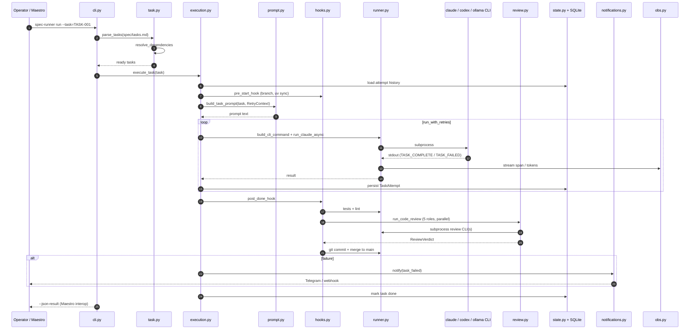
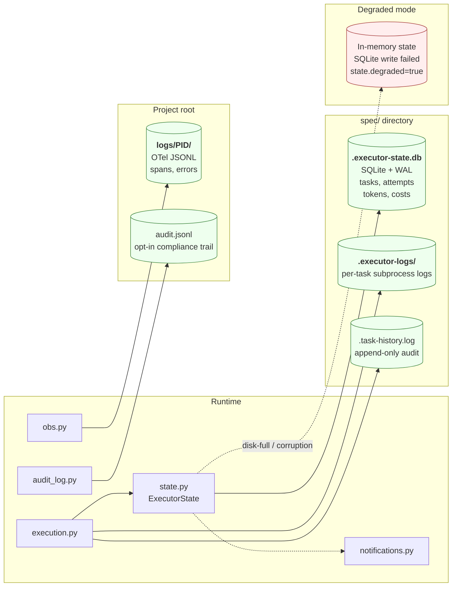

# spec-runner — architecture

Layered view of `spec-runner` v2.9.0. Generated 2026-05-25, module map refreshed 2026-07-07 (added `preset_cmd.py`, `doctor.py`, `spec.py`, `spec_commands.py`; C1 stage profiles).

## System context

External actors, integrations, and where they touch spec-runner.

```mermaid
flowchart LR
    operator([Operator / CI])
    maestro[Maestro<br/>orchestrator]
    mcp_client[MCP client<br/>e.g. Claude Desktop]
    gh_api[GitHub<br/>Issues API]
    telegram[Telegram<br/>bot]
    webhook_rx[Webhook<br/>receiver]
    claude_cli[claude CLI]
    codex_cli[codex CLI]
    other_cli[ollama / llama-cli<br/>llama-server / custom]
    gh_cli[gh CLI]
    git_bin[git]

    subgraph sr["spec-runner"]
        direction TB
        sr_cli[CLI<br/>spec-runner ...]
        sr_mcp[MCP server<br/>stdio]
        sr_tui[TUI dashboard]
        sr_state[(.executor-state.db<br/>SQLite + WAL)]
        sr_obs[(logs/PID.jsonl<br/>OTel)]
        sr_audit[(audit.jsonl)]
    end

    operator --> sr_cli
    operator --> sr_tui
    maestro -- --json-result<br/>+ reads --> sr_cli
    maestro -. SQLite read .-> sr_state
    mcp_client -- stdio --> sr_mcp

    sr_cli --> claude_cli & codex_cli & other_cli
    sr_cli --> git_bin
    sr_cli --> gh_cli --> gh_api
    sr_cli -. task_failed<br/>run_complete<br/>state_degraded .-> telegram & webhook_rx
    sr_cli --> sr_state & sr_obs & sr_audit
    sr_tui --> sr_state

    classDef ext fill:#eef,stroke:#446
    classDef cli fill:#ffe,stroke:#a82
    classDef store fill:#efe,stroke:#484
    class operator,maestro,mcp_client,gh_api,telegram,webhook_rx ext
    class claude_cli,codex_cli,other_cli,gh_cli,git_bin cli
    class sr_state,sr_obs,sr_audit store
```

## Module map

Layered view of the modules in `src/spec_runner/`.

```mermaid
flowchart TB
    subgraph entry["Entry points"]
        direction LR
        cli["cli.py<br/>argparse dispatcher<br/>cmd_run / cmd_watch<br/>build_task_json_result"]
        mcp_server["mcp_server.py<br/>MCPServer, stdio"]
        tui["tui.py<br/>Textual dashboard"]
        executor_mod["executor.py<br/>signal handlers<br/>re-exports"]
    end

    subgraph commands["Command modules"]
        direction LR
        cli_info["cli_info.py<br/>status / verify<br/>report / costs / logs"]
        cli_plan["cli_plan.py<br/>plan (interactive + --full + --gated)"]
        spec_cmds["spec_commands.py<br/>spec status/approve<br/>reject/adopt/check"]
        preset_cmd["preset_cmd.py<br/>config (CLI presets)"]
        doctor_cmd["doctor.py<br/>CLI/model probe"]
        task_cmds["task_commands.py<br/>list / show / next<br/>graph / stats"]
        github_sync["github_sync.py<br/>sync-to-gh<br/>sync-from-gh"]
        init_cmd["init_cmd.py<br/>install skills"]
    end

    subgraph core["Orchestration core"]
        direction LR
        execution["execution.py<br/>execute_task<br/>retry strategy<br/>RetryContext"]
        errors_m["errors.py<br/>classify stderr<br/>→ error_kind"]
        stages_m["stages.py<br/>StageReporter<br/>sub-stage progress"]
        hooks["hooks.py<br/>pre_start_hook<br/>post_done_hook"]
        review["review.py<br/>5 REVIEW_ROLES<br/>parallel review<br/>HITL gate"]
        verify_m["verify.py<br/>compliance check"]
        audit_m["audit.py<br/>static spec audit"]
        validate_m["validate.py<br/>config + task validation"]
        report_m["report.py<br/>REQ→DESIGN→TASK matrix"]
    end

    subgraph domain["Domain"]
        direction LR
        task["task.py<br/>Task dataclass<br/>dep graph<br/>parse_tasks"]
        state["state.py<br/>ExecutorState ctx mgr<br/>SQLite + WAL<br/>ErrorCode / ReviewVerdict<br/>degraded-mode"]
        config["config.py<br/>ExecutorConfig<br/>Persona / ExecutorLock<br/>spec_governance / YAML loader"]
        prompt["prompt.py<br/>build_task_prompt<br/>SPEC_STAGES<br/>constitution"]
        spec_m["spec.py<br/>StageProfile / StageDef<br/>SpecMeta frontmatter<br/>draft/approved/stale<br/>locked read/write_spec"]
    end

    subgraph adapters["Infra adapters"]
        direction LR
        runner["runner.py<br/>build_cli_command<br/>run_claude_async<br/>parse_token_usage"]
        git_ops["git_ops.py<br/>branch / main<br/>test file mapping"]
        plugins["plugins.py<br/>plugin discovery<br/>hook execution"]
        notifications_m["notifications.py<br/>Telegram + webhook<br/>template render"]
        obs["obs.py<br/>init_logging<br/>span / child_env<br/>OTel JSONL"]
        logging_m["logging.py<br/>back-compat shim"]
        audit_log["audit_log.py<br/>compliance JSONL"]
        events["events.py<br/>EventBus<br/>TaskEvent"]
    end

    entry --> commands
    commands --> core
    core --> domain
    core --> adapters
    domain --> adapters
    logging_m --> obs

    classDef entryC fill:#ffe7b3,stroke:#a76d00
    classDef cmdC fill:#fff3cc,stroke:#a8920a
    classDef coreC fill:#cfe8ff,stroke:#1f6fb3
    classDef domainC fill:#d6f0d6,stroke:#2f7a2f
    classDef adapterC fill:#f0d6f0,stroke:#7a2f7a
    class cli,mcp_server,tui,executor_mod entryC
    class cli_info,cli_plan,spec_cmds,preset_cmd,doctor_cmd,task_cmds,github_sync,init_cmd cmdC
    class execution,errors_m,stages_m,hooks,review,verify_m,audit_m,validate_m,report_m coreC
    class task,state,config,prompt,spec_m domainC
    class runner,git_ops,plugins,notifications_m,obs,logging_m,audit_log,events adapterC
```

## Key data flow — task execution

How a single task moves through the system.

```mermaid
sequenceDiagram
    autonumber
    participant U as Operator / Maestro
    participant CLI as cli.py
    participant T as task.py
    participant E as execution.py
    participant P as prompt.py
    participant H as hooks.py
    participant R as runner.py
    participant CC as claude / codex / ollama CLI
    participant Rev as review.py
    participant St as state.py + SQLite
    participant N as notifications.py
    participant O as obs.py

    U->>CLI: spec-runner run --task=TASK-001
    CLI->>T: parse_tasks(spec/tasks.md)
    T->>T: resolve_dependencies
    T-->>CLI: ready tasks
    CLI->>E: execute_task(task)
    E->>St: load attempt history
    E->>H: pre_start_hook (branch, uv sync)
    E->>P: build_task_prompt(task, RetryContext)
    P-->>E: prompt text

    loop run_with_retries
        E->>R: build_cli_command + run_claude_async
        R->>CC: subprocess
        CC-->>R: stdout (TASK_COMPLETE / TASK_FAILED)
        R->>O: stream span / tokens
        R-->>E: result
        E->>St: persist TaskAttempt
    end

    E->>H: post_done_hook
    H->>R: tests + lint
    H->>Rev: run_code_review (5 roles, parallel)
    Rev->>R: subprocess review CLI(s)
    Rev-->>H: ReviewVerdict
    H->>R: git commit + merge to main

    alt failure
        E->>N: notify(task_failed)
        N-->>U: Telegram / webhook
    end

    E->>St: mark task done
    CLI-->>U: --json-result (Maestro interop)
```

## Storage and persistence

```mermaid
flowchart LR
    subgraph runtime["Runtime"]
        execution["execution.py"]
        state["state.py<br/>ExecutorState"]
        obs["obs.py"]
        audit_log["audit_log.py"]
        notifications["notifications.py"]
    end

    subgraph specdir["spec/ directory"]
        db[("<b>.executor-state.db</b><br/>SQLite + WAL<br/>tasks, attempts<br/>tokens, costs")]
        logs_dir[("<b>.executor-logs/</b><br/>per-task subprocess logs")]
        task_hist[(".task-history.log<br/>append-only audit")]
    end

    subgraph rootdir["Project root"]
        obs_dir[("<b>logs/PID/</b><br/>OTel JSONL<br/>spans, errors")]
        audit_file[("audit.jsonl<br/>opt-in compliance trail")]
    end

    subgraph degraded["Degraded mode"]
        mem[(In-memory state<br/>SQLite write failed<br/>state.degraded=true)]
    end

    execution --> state --> db
    execution --> logs_dir
    execution --> task_hist
    obs --> obs_dir
    audit_log --> audit_file
    state -. disk-full / corruption .-> mem
    state -.-> notifications

    classDef store fill:#efe,stroke:#484
    classDef degraded fill:#fee,stroke:#a44
    class db,logs_dir,task_hist,obs_dir,audit_file store
    class mem degraded
```

## TDD checkpoint machinery (`execution_mode: tdd`)

Under `execution_mode: tdd`, `execute_task` runs a RED authoring pass before
the implementation call: an agent writes one failing test, spec-runner
replays it in an isolated `git worktree`, and records the outcome as a
`RedCheckpoint` (`tdd.py`, `tdd_runners.py`). `lifecycle.py` tracks the
RED → GREEN phase machine, `claims.py` freezes the byte contents of the file
the red test lives in until the task completes, and `remedy.py` gives an
operator a narrow, audited door (`abandon`/`repair`/`resume`/`release`) to
recover a wedged checkpoint. `tdd_status.py` reports all of this via
`spec-runner tdd status`.

### Evidential file naming carries a namespace segment (#334)

The file a RED pass writes its failing test to is called the **evidential**
file. Its path is named by the runner adapter itself (`evidential_file()` in
`tdd_runners.py` — never a shared cross-adapter heuristic, per #198/#220/#252),
and since #334 that path always includes a **namespace segment**
(`namespace_segment()`), so two workstreams that both happen to run a task
called `TASK-001` do not write the same red file and stomp on each other's
checkpoint.

The segment always has two parts, `<slug>_<digest>`:

- a readable **slug** — a lower-cased, punctuation-collapsed rendering of the
  namespace, capped in length for readability;
- a short **digest** — a SHA-256 prefix of the *raw* namespace string, taken
  before the slug's own case-folding/truncation, so two namespaces that would
  slug identically (differing only by case, a separator, or a truncated tail)
  still land on different segments.

Which namespace feeds the formula is decided by `tdd.resolve_namespace()`:

- **declared** — a project that sets the config key `tdd_namespace` gets a
  segment whose slug is legibly derived from that value (an orchestrator that
  knows its own workstream identity states it rather than have it guessed);
- **computed fallback** — without a declared `tdd_namespace`, the namespace is
  derived from `project_root` + `spec_prefix`, and the segment's slug is
  already digest-shaped (there is nothing human-readable to slug).

**Distinguishability boundary:** the guarantee holds only for a distinguishable
input. Two workstreams sharing the same `spec_prefix` (including both empty)
and neither declaring a `tdd_namespace` are, to this formula, the same input —
they get the same namespace and the same evidential path; this is a declared
boundary, not a silent collision, and the existing #252 D "cannot write a red
into an existing file" refusal still fires rather than one workstream quietly
overwriting the other's checkpoint. The remedy is to declare a distinct
`tdd_namespace` per workstream, or give each a distinct `spec_prefix`.
Previously-recorded checkpoints and claims (from before #334) keep working
without any migration step: they key off the stored selector and commit SHA,
never off the file's name.

### Pre-freeze lint auto-fix (#341)

Before a RED checkpoint freezes a file, `tdd._lint_claimed` lints the file
about to be claimed — but only when the project has **declared** a linter
(`commands.lint`, `config.lint_command_declared`; #220's boundary is
unchanged, an inferred Python-shaped lint command is never run against a
project that never asked for one). A lint failure there no longer refuses
immediately: spec-runner now attempts a bounded repair first —

1. a mechanical fix pass, running the project's separately **declared** fix
   invocation (`commands.lint_fix` / `config.lint_fix_command_declared` —
   `lint_fix_command` itself always carries a Python-shaped default, but that
   default is not itself a declaration, so "declared a linter" does not imply
   "declared a fix invocation"), narrowed to the claimed file's paths;
2. if a finding survives the mechanical fix, exactly **one cold agent
   round** — a fresh, session-less call, carrying the remaining findings, the
   red file and the selector, since spec-runner keeps no session to resume —
   never a loop, and never a second agent round.

Both steps are skipped, with the refusal naming the specific reason, when
`lint_command` is a **composite lint_command** (more than one command
chained by a shell operator): spec-runner does not guess which component
would take a path or a fix flag (the #139 lesson), so fix mode is not applied
at all for a composite command, declared fix invocation or not. The repair
never touches files outside the claim, and a repair that makes the test pass
(or breaks the build) does not produce a checkpoint — a green or unbuildable
result is not a confirmed red.

## Verify-first execution mode (`execution_mode: verify_first`, #367)

`verify_first` is the **third** execution mode, alongside `standard` and
`tdd` — declared per task with `**Mode:** verify_first` in `tasks.md` and
resolved by the same `ExecutorConfig.resolve_execution_mode()` the other two
modes already use, so it works at any project default and needs no
migration for tasks that don't declare it. It is for a task whose job is to
**verify already-delivered behaviour** rather than build new behaviour under
RED/GREEN: instead of authoring a failing test first, it starts execution
with a **live run** of a group of checks that are expected to already be
green, and lets that run's outcome decide whether anything further needs to
happen at all.

**Declaring the group (`**Verifies:**`).** A verify-first task must declare,
in its own dedicated tasks.md metadata line (`**Verifies:** <selector>[,
<selector>…]`, alongside `**Mode:**`/`**Traces to:**`/`**Depends on:**`), the
exact group of selectors it verifies — a pytest node id today
(`path::test`), the same dictionary `tdd_runners.Selector`/`parse_selector`
already accepts for RED replay. The group is stored on `Task.verifies` in
declared order and **never inferred** — not from `Traces to`, not from
filenames, not from the task's diff, not from a checklist's prose line — a
group can only come from this one line. The comma form and a multi-line
`- ` block are both accepted; a pytest node id containing a comma inside an
unclosed `[...]` parameter cannot be told apart from a second selector in
the comma form, so that shape is refused (quoting the declared line
verbatim) rather than guessed, with a pointer to the multi-line form. A
missing or empty group under `verify_first` is refused before anything
runs, at config/tasks load time and in `spec-runner validate` — this is the
normal path, catching the mistake before a single subprocess spends any
time. It is also, separately, one of the enumerated `instrument-error`
inputs at task-execution time (below): `spec-runner watch` validates once
before its loop and does not re-validate on every iteration, so a task
added or edited with a missing/empty `**Verifies:**` line after that
validation still reaches the live run, which refuses it there as a
fail-closed backstop rather than a silent guess.

**The live run.** For a `verify_first` task, the live run is the task's
**first** action — after the branch stage has put the tree in a known
committed state, and **before any paid agent call**, including the RED
authoring pass `tdd` mode would otherwise run first. It replays the
declared group, one subprocess per selector, in a disposable detached `git
worktree` against the named commit (HEAD at that point) — the same shape
`tdd.verify_red` already uses for a red checkpoint — so the verdict is about
that **commit**, not the surrounding working tree, and a judge that cannot
be named (an unresolvable adapter, or a composite `test_command` that
cannot be narrowed to one selector) is `instrument_error`, never a guess.
The run is scoped to exactly the declared group — never the project's whole
suite, even against a default `test_command` that already names a
directory — by replacing the command's path argument rather than appending
to it (mirroring `git_ops.build_scoped_test_command`'s replace-not-append
rule for the post-done hook).

**Outcomes and branching.** Every live run resolves to exactly one of three
outcomes, and the mapping is exhaustive by construction — anything not
positively proven `green` or `test-failure` falls through to
`instrument-error` rather than an unenumerated fourth outcome
(`live_verify.classify_verify_outcome`):

- **`green`** — every declared selector's run is proven, per-selector, on
  all three axes: the run passed, the adapter proved the *requested*
  selector is what ran (not merely that "the run as a whole passed"), and
  the selector was proven to actually **execute** (a `skipped`/`deselected`/
  `xfail`/`xpass` line is not execution, even though it still carries the
  requested node id and would otherwise read as a pass). Green opens the
  **green-only path**: no RED authoring pass runs, no red is purchased, and
  the red gate is satisfied by a reference to verify-evidence instead of a
  confirmed red checkpoint — concretely, the *latest* recorded evidence row
  for the task (`_verify_first_gate` reads `state.verify_evidence(...)`),
  which by the time the gate is actually asked is normally one of the later
  re-verifies against the merge candidate (see "Declared boundaries" below),
  not necessarily this entry run. The task then continues its normal paid
  pass and reaches DONE exactly like any other task.
- **`test-failure`** — at least one declared selector is proven to have
  actually failed (proven selection, proven execution, but the run failed),
  even if the rest of the group passed — a mixed group is a real failure,
  not an instrument problem. The task falls through into the **unmodified
  TDD cycle**, starting with RED authoring, with no gate relaxed and no
  behaviour softened relative to a plain `tdd` task.
- **`instrument-error`** — anything else: an unresolvable adapter, a
  composite `test_command`, an unreachable commit, an undeclared or
  unparseable group, an empty or fully-skipped selection, a run that passed
  without proving the requested selection, or evidence whose ancestry to
  the candidate tree cannot be established. This stops the task
  **fail-closed** — neither branch runs, no paid call happens — with an
  infrastructure exit class (`ErrorCode.INFRASTRUCTURE`, exit 2) and a
  message naming exactly what could not be established.

**Verify-evidence.** Every live run is recorded as a durable
`live_verify.VerifyEvidence` row in state, independent of which of the
three outcomes it reached, and distinct on purpose from `tdd.RedCheckpoint`
— a green-only run never wrote a red, so a reader of red checkpoints that
has no notion of verify-evidence keeps answering "no red" for it rather
than mistaking it for one. The record carries enough for a third party to
reproduce the run without the original log: task/workstream identity, the
judged commit SHA, the group **as declared** and the group **as actually
executed** (which can be shorter — the first failing or unrunnable
selector stops the group), the policy config hash (the same `POLICY_KEYS`
hash the gates use), the environment identity (`environment_id`), the
name of the judging adapter, the outcome, the failure detail in the
refusal's own words, a timestamp, and the harness itself as the recording
actor (never an operator — `record_waiver` remains the only
operator-authored override and is never called by this path). Evidence is
tied to the question it answered: it stops being reusable the moment any
`POLICY_KEYS` value changes (including the *project-level* `execution_mode`
default — the config attribute the hash is computed from, not a task's own
`**Mode:**` override; `VerifyEvidence` records no per-task-mode axis
separately), the moment the declared group changes, or when the candidate
no longer descends from the evidence's commit — reusing it across any of
those changes would answer a different question with an old row's yes.

**Declared boundaries.** Two limits are intentional, not gaps to be closed
later:

- **One run per decision point, no retry policy (Q-05).** The declared
  group is judged live at up to three decision points in an attempt, each
  asking a different question about a different commit: the task's entry
  action, before any paid call (`_run_verify_first_phase`, above); again
  immediately before the paid review call, whenever `run_review` is
  enabled (`hooks._reverify_before_review`), so a review is not bought
  against a candidate no run has actually judged; and again, the
  authoritative read, right before the pre-terminal merge gate, against
  the tree that will actually merge (`hooks._reverify_live_evidence_for_candidate`)
  — skipped only when that candidate's tree already matches what the
  immediately preceding review-time replay just confirmed. That floor of
  two replays and ceiling of three is deliberate, not an oversight: what
  Q-05 actually bounds is *within* each of those points — a recorded
  outcome at a given commit is what was *observed*, once, never an average
  over repeated attempts at judging that same commit. A flaky declared
  group is not resolved by averaging at any one point; it is resolved by
  making each run re-checkable (the evidence names the exact SHA and group
  so anyone can replay it) and by asking the gate again, against a fresh
  commit, at the next decision point. If a consumer arrives with a
  measurably flaky group, this boundary is revisited then — it is not
  solved implicitly here.
- **The group is frozen, and released on DONE (Q-06).** After a `green`
  outcome, the task still runs its normal paid agent pass, which is
  physically capable of editing the very files the evidence is a
  statement about. To prevent that from silently invalidating what the
  evidence claims, the declared group's files are frozen by the same
  claim/byte-lock machinery (`claims.py`) a red checkpoint already uses,
  for the duration of the task, and released by `release_claims` at the
  DONE transition (#260) — exactly like every other claim, so a verified
  task does not tax its neighbours after it finishes. The consequence is
  explicit: a verify-first task's own paid pass does not edit the files of
  its own declared group; any new pins or new checks it produces on the
  green path go into a separate, unclaimed file.

**The repeated test runs are intentional (NFR-02).** None of the live
verify replays enumerated under Q-05 above are deduplicated against each
other, and none of them are deduplicated against `post_done_hook`'s own
test run, even though all of them run tests for the same task. Each asks a
different question of a different tree: the entry run judges the commit
the task starts from, scoped to the declared group, before any paid work
happens; the pre-review and pre-terminal re-verifies judge the *candidate*
commit the task has produced so far, at two different moments the
candidate can still change (a review fix moving HEAD between them); and
`post_done_hook` judges the tree the paid pass actually produced, against
the project's full test command, after the work happens — always run,
independent of `verify_first`. Collapsing any of these would answer one
question with another's evidence.

**Selector dictionary boundary.** The declared group's selectors are drawn
from whatever dictionary the project's resolved runner adapter already
accepts — for pytest, that is a node id of the form `path::test`; nothing
else is a selector, including a bare file path. A **file target is not
declarable today** (unlike the `checked_by target: tests/test_x.py` form
seen upstream): a caller that wants to verify "this file's tests" must
emit node ids, one per test, not a single file-level target. Extending the
dictionary to file-level selectors, with proof of selection at the same
strength (which tests in the file actually ran, not merely "exit 0"), is a
deliberately open question left to a later workstream, not a defect of
this one.

## Notes

- **Entry points** in `pyproject.toml`: `spec-runner` (→ `executor:main`), `spec-task` (deprecated), `spec-runner-init`.
- **CLI agnostic**: `runner.build_cli_command()` auto-detects `claude` / `codex` / `opencode` / `pi` / `ollama` / `llama-cli` / `llama-server` based on command name, or uses a custom `command_template` with `{cmd} {model} {prompt} {prompt_file}` placeholders. (`codex` uses `codex exec -m {model} {prompt}`; its `-p` is `--profile`, not the prompt.)
- **Maestro interop contract** (R-04): SQLite schema + `--json-result` stdout. See `docs/state-schema.md`, `schemas/*.json`, `tests/test_json_result_contract.py`. Frozen at v2.0.0.
- **Observability** (v2.1.0): `obs.py` is the reference implementation of the cross-project OTel JSONL contract (`maestro/contracts/observability/log-schema.json`), already vendored into Maestro, arbiter, and ATP.
- **Gated spec governance** (v2.7.0): `spec.py` defines the `SpecMeta` frontmatter (draft/approved/stale) shared by `requirements.md`/`design.md`/`tasks.md`; `cli_plan.py`'s `plan --gated` generates one stage at a time, `spec_commands.py` implements `spec status/approve/reject/adopt/check`, and `config.spec_governance` (`off`|`strict`) gates `run`/`watch` on an approved `tasks.md` via `cli.spec_run_gate_ok()`. See `README.md#spec-governance-gated-generation`.
- **Stage profiles** (v2.9.0): `spec.py`'s `StageProfile`/`StageDef` make the stage chain data, loaded from bundled `profiles/*.yaml`; the default `lite` profile reproduces `requirements → design → tasks`. `spec.py`, `prompt.py` (templates/markers/prompt text), and `validate.py` (`VALIDATORS` registry keyed by `validator_key`) all read stages from the resolved profile. Selected via `config.spec_profile` / `--profile`. Behaviour-preserving: `SPEC_STAGES` and existing specs are unchanged under `lite`.
